# MiscarriageRisk-AI: Machine Learning for ART Outcome Prediction


# 📚 Documentation

<div align="center">

## 🔄 Pipeline Overview

```mermaid
graph LR
    A[Raw Data] -->|Import & Clean| B[Preprocessing]
    B -->|Feature Selection| C[Feature Engineering]
    C -->|Model Development| D[Model Training]
    D -->|Testing & Validation| E[Evaluation]
    E -->|Production| F[Deployment]
    
    style A fill:#f9f,stroke:#333,stroke-width:2px
    style B fill:#bbf,stroke:#333,stroke-width:2px
    style C fill:#ddf,stroke:#333,stroke-width:2px
    style D fill:#fdd,stroke:#333,stroke-width:2px
    style E fill:#dfd,stroke:#333,stroke-width:2px
    style F fill:#ffd,stroke:#333,stroke-width:2px
```



</div>


## 🔍 Key Components

<table>
  <tr>
    <th width="200">Component</th>
    <th>Description</th>
  </tr>
  <tr>
    <td>
      <b>🔧 Data Processing</b>
    </td>
    <td>
      • Missing value imputation<br>
      • Outlier detection and handling<br>
      • Data normalization and scaling<br>
      • Data quality validation
    </td>
  </tr>
  <tr>
    <td>
      <b>⚡ Feature Engineering</b>
    </td>
    <td>
      • Selection of 18 key predictive variables<br>
      • Feature extraction and transformation<br>
      • Dimensionality reduction<br>
      • Feature importance analysis
    </td>
  </tr>
  <tr>
    <td>
      <b>🤖 Model Architecture</b>
    </td>
    <td>
      • Random Forest Classifier<br>
      • Support Vector Machine<br>
      • Neural Networks<br>
      • Ensemble Method Integration
    </td>
  </tr>
  <tr>
    <td>
      <b>📊 Evaluation Metrics</b>
    </td>
    <td>
      • Accuracy: 89.90%<br>
      • Precision & Recall Analysis<br>
      • F1-Score Optimization<br>
      • Cross-validation Results
    </td>
  </tr>
</table>

</div>

## 📞 Contact Information

<div align="center">
  <table>
    <tr>
      <td align="center">
        
      </td>
      <td>
        <a href="mailto:mozr2010@gmail.com">mozr2010@gmail.com</a>
      </td>
    </tr>
    <tr>
      <td align="center">
        
      </td>
      <td>
        ESHRE 40th Annual Meeting Presenter
      </td>
    </tr>
  </table>
</div>

## 📖 Academic Citation

```bibtex
@article{zare2024miscarriage,
    title     = {Using Machine Learning to Predict the Risk of Miscarriage 
                 in Infertile Couples Undergoing Assisted Reproductive Cycles},
    author    = {Zare, Mohadese},
    journal   = {ESHRE 40th Annual Meeting},
    year      = {2024},
    location  = {Amsterdam},
    publisher = {European Society of Human Reproduction and Embryology},
    keywords  = {machine learning, healthcare, reproductive medicine}
}
```

<div align="center">
  
  
</div>
```


