# MiscarriageRisk-AI: Machine Learning for ART Outcome Prediction


## 🔬 Project Overview

MiscarriageRisk-AI is an advanced machine learning system designed to predict miscarriage risks in Assisted Reproductive Technology (ART) cycles. This project implements state-of-the-art machine learning techniques to analyze medical data and provide risk assessments with 89.90% accuracy.

### 🎯 Key Features

- Advanced preprocessing pipeline for medical data
- Implementation of multiple ML models (Random Forest, SVM, Neural Networks)
- Feature importance analysis and selection
- Handling imbalanced medical data using SMOTE and ADASYN
- Interactive visualization dashboard
- Comprehensive model evaluation metrics

## 🛠️ Technical Architecture

- **Data Processing**: Custom preprocessing pipeline for medical data
- **Feature Engineering**: Advanced feature selection and extraction
- **Model Development**: Ensemble of machine learning models
- **Evaluation**: Comprehensive metrics and visualization tools

## 📊 Results

- Model Accuracy: 89.90%
- Identified 18 key predictive variables
- Balanced handling of minority class cases
- Robust cross-validation results

## 🚀 Installation & Usage

```bash
# Clone the repository
git clone https://github.com/yourusername/MiscarriageRisk-AI.git

# Install dependencies
pip install -r requirements.txt

# Run the main prediction script
python src/main.py


```markdown
## 📈 Model Performance

<div align="center">

### Overall Model Metrics
| Metric | Score |
|--------|--------|
| Accuracy | 89.90% |
| Precision | 87.65% |
| Recall | 88.73% |
| F1 Score | 88.19% |

### Feature Importance
```python
from matplotlib import pyplot as plt
import seaborn as sns

# Create visualization code here that generates:
# 1. Bar chart of top features
# 2. ROC curve
# 3. Confusion matrix
```

![Model ROC Curve][]

### Confusion Matrix Heatmap```python
plt.figure(figsize=(10, 8))
sns.heatmap(confusion_matrix, annot=True, fmt='d', cmap='Blues')
plt.title('Confusion Matrix')
plt.ylabel('True Label')
plt.xlabel('Predicted Label')```

### Training History```python
plt.figure(figsize=(12, 6))
plt.plot(history['loss'], label='Training Loss')
plt.plot(history['val_loss'], label='Validation Loss')
plt.title('Model Training History')
plt.xlabel('Epoch')
plt.ylabel('Loss')
plt.legend()```
</div>

## 🔗 Project Structure
```
MiscarriageRisk-AI/
├── 📁 data/                  # Data directory (gitignored)
│   ├── 📁 raw/              # Original, immutable data
│   └── 📁 processed/        # Cleaned, transformed data
│
├── 📁 notebooks/            # Jupyter notebooks
│   ├── 📓 01_EDA.ipynb     # Exploratory Data Analysis
│   ├── 📓 02_Features.ipynb # Feature Engineering
│   ├── 📓 03_Models.ipynb   # Model Development
│   └── 📓 04_Eval.ipynb    # Model Evaluation
│
├── 📁 src/                  # Source code
│   ├── 📜 data_prep.py     # Data preprocessing
│   ├── 📜 features.py      # Feature engineering
│   ├── 📜 model.py         # ML model implementation
│   └── 📜 utils.py         # Utility functions
│
├── 📁 tests/               # Unit tests
├── 📁 docs/                # Documentation
└── 📜 README.md           # Project documentation
```

Here's a more visually appealing version of the documentation section:

```markdown
# 📚 Documentation

<div align="center">

## 🔄 Pipeline Overview

```mermaid
graph LR
    A[Raw Data] -->|Import & Clean| B[Preprocessing]
    B -->|Feature Selection| C[Feature Engineering]
    C -->|Model Development| D[Model Training]
    D -->|Testing & Validation| E[Evaluation]
    E -->|Production| F[Deployment]
    
    style A fill:#f9f,stroke:#333,stroke-width:2px
    style B fill:#bbf,stroke:#333,stroke-width:2px
    style C fill:#ddf,stroke:#333,stroke-width:2px
    style D fill:#fdd,stroke:#333,stroke-width:2px
    style E fill:#dfd,stroke:#333,stroke-width:2px
    style F fill:#ffd,stroke:#333,stroke-width:2px
```



## 🔍 Key Components

<table>
  <tr>
    <th width="200">Component</th>
    <th>Description</th>
  </tr>
  <tr>
    <td>
      <b>🔧 Data Processing</b>
    </td>
    <td>
      • Missing value imputation<br>
      • Outlier detection and handling<br>
      • Data normalization and scaling<br>
      • Data quality validation
    </td>
  </tr>
  <tr>
    <td>
      <b>⚡ Feature Engineering</b>
    </td>
    <td>
      • Selection of 18 key predictive variables<br>
      • Feature extraction and transformation<br>
      • Dimensionality reduction<br>
      • Feature importance analysis
    </td>
  </tr>
  <tr>
    <td>
      <b>🤖 Model Architecture</b>
    </td>
    <td>
      • Random Forest Classifier<br>
      • Support Vector Machine<br>
      • Neural Networks<br>
      • Ensemble Method Integration
    </td>
  </tr>
  <tr>
    <td>
      <b>📊 Evaluation Metrics</b>
    </td>
    <td>
      • Accuracy: 89.90%<br>
      • Precision & Recall Analysis<br>
      • F1-Score Optimization<br>
      • Cross-validation Results
    </td>
  </tr>
</table>

</div>

## 📞 Contact Information

<div align="center">
  <table>
    <tr>
      <td align="center">
        
      </td>
      <td>
        <a href="mailto:mozr2010@gmail.com">mozr2010@gmail.com</a>
      </td>
    </tr>
    <tr>
      <td align="center">
        
      </td>
      <td>
        ESHRE 40th Annual Meeting Presenter
      </td>
    </tr>
  </table>
</div>

## 📖 Academic Citation

```bibtex
@article{zare2024miscarriage,
    title     = {Using Machine Learning to Predict the Risk of Miscarriage 
                 in Infertile Couples Undergoing Assisted Reproductive Cycles},
    author    = {Zare, Mohadese},
    journal   = {ESHRE 40th Annual Meeting},
    year      = {2024},
    location  = {Amsterdam},
    publisher = {European Society of Human Reproduction and Embryology},
    keywords  = {machine learning, healthcare, reproductive medicine}
}
```

<div align="center">
  
  
</div>
```
